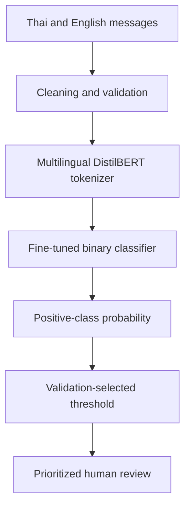
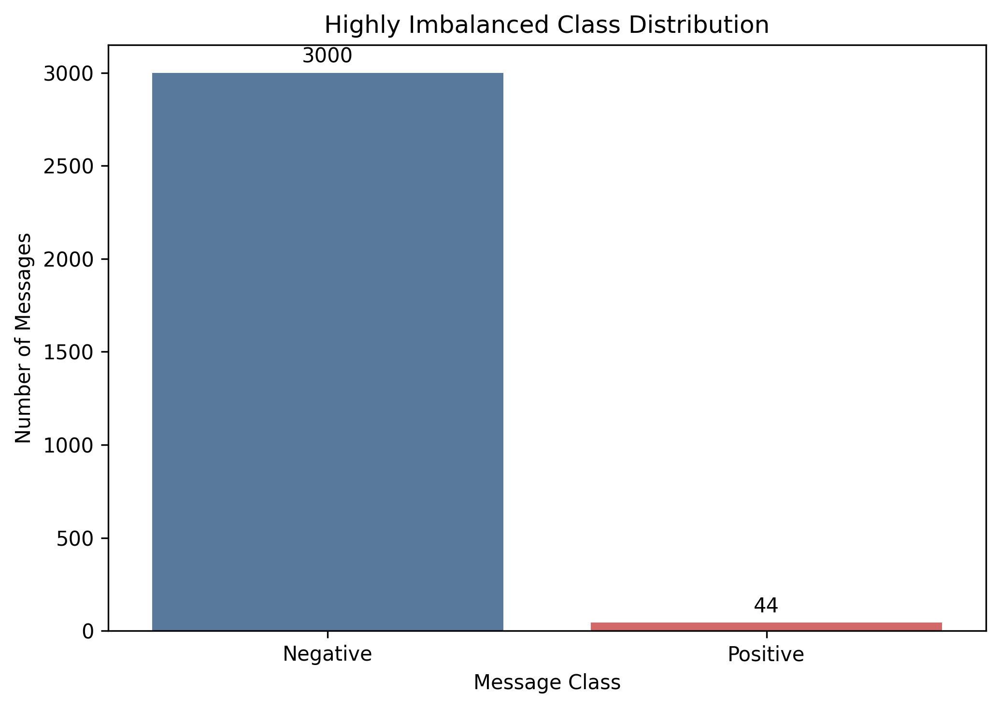
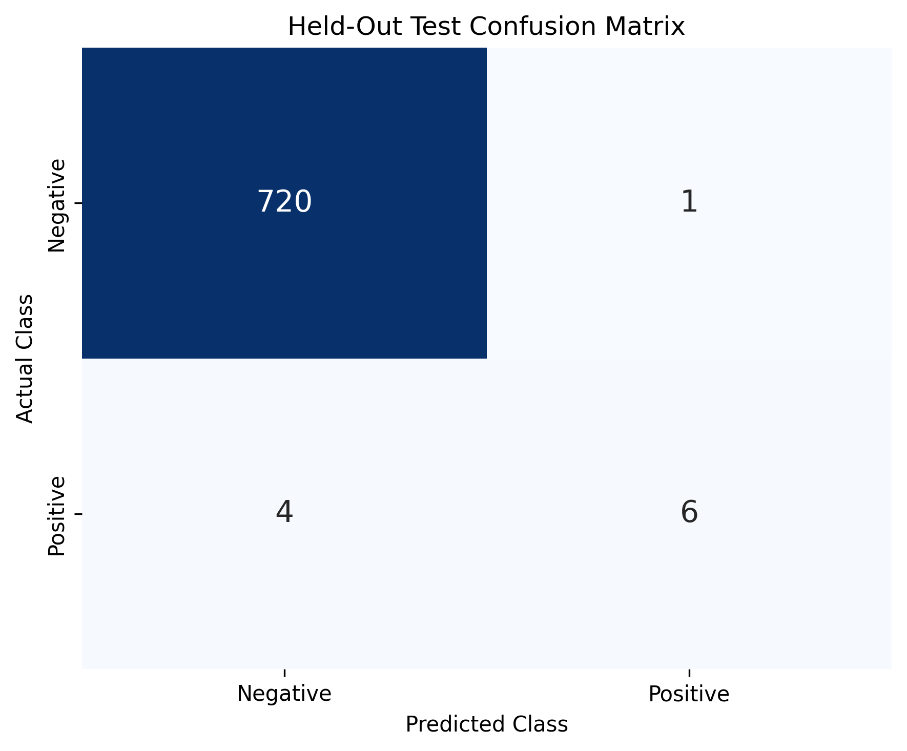

# Multilingual Trust & Safety NLP

A Thai–English text-classification project that fine-tunes multilingual DistilBERT to identify potential off-platform communication and policy-violating intent. The project demonstrates an end-to-end NLP workflow for a highly imbalanced classification problem, including data validation, Transformer fine-tuning, validation-based threshold selection, held-out evaluation, and responsible human review.

> **Portfolio note:** The original operational data is confidential and is not included. The public sample contains only synthetic messages and is intended to demonstrate the expected data format—not reproduce the reported model performance.

## Business problem

Online learning and service platforms may need to identify messages that attempt to move communication or transactions outside the platform. Reviewing every message manually is slow and difficult to scale.

This project explores how multilingual NLP can help prioritize potentially risky Thai and English messages for review while limiting unnecessary alerts. The model is designed as decision support for trained reviewers, not as the sole basis for punitive action.

## Solution overview



The classifier predicts:

- **Class 0 — Negative:** no off-platform communication intent
- **Class 1 — Positive:** potential off-platform communication or policy violation

## Dataset

The experiment uses a curated labeled subset drawn from a larger operational corpus.

| Class | Messages | Percentage |
|---|---:|---:|
| Negative | 3,000 | 98.55% |
| Positive | 44 | 1.45% |
| **Total** | **3,044** | **100%** |

The data was divided using stratified sampling:

- 52% training
- 24% validation
- 24% held-out testing

The validation set was used for model selection and decision-threshold optimization. The test set was evaluated only after the threshold had been selected.



## Modeling approach

- Base model: `distilbert-base-multilingual-cased`
- Task: binary sequence classification
- Languages: Thai and English
- Maximum sequence length: 64 tokens
- Optimizer learning rate: `2e-5`
- Maximum training epochs: 10
- Early stopping: validation loss with patience of two epochs
- Primary metrics: precision, recall, and F1 score
- Decision threshold: selected by maximizing validation F1

Accuracy is not used as the primary measure because 98.55% of the labeled examples are negative. A classifier predicting nearly every message as negative could achieve high accuracy while failing to detect most policy violations.

## Held-out test results

The validation-selected threshold was **0.06**. Applying it once to the held-out test set produced:

| Metric | Result |
|---|---:|
| Accuracy | 99.04% |
| Precision | 66.67% |
| Recall | 60.00% |
| F1 score | 63.16% |

The test set contained 10 positive examples. The model identified six, missed four, and generated three false-positive alerts.

| Outcome | Count |
|---|---:|
| True negatives | 718 |
| False positives | 3 |
| False negatives | 4 |
| True positives | 6 |



Because the test set contains only 10 positive examples, these results are preliminary. A single prediction can materially change precision, recall, and F1.

## Repository structure

```text
multilingual-trust-safety-nlp/
├── README.md
├── requirements.txt
├── .gitignore
├── notebooks/
│   └── multilingual_trust_safety_nlp.ipynb
├── data/
│   ├── README.md
│   └── sample_messages.csv
└── reports/
    └── figures/
        ├── class_distribution.png
        ├── confusion_matrix.png
        └── threshold_performance.png
```

## Run the notebook

1. Clone the repository:

   ```bash
   git clone https://github.com/araya-chaowalit/multilingual-trust-safety-nlp.git
   cd multilingual-trust-safety-nlp
   ```

2. Install the dependencies:

   ```bash
   pip install -r requirements.txt
   ```

3. Open the notebook:

   ```bash
   jupyter notebook notebooks/multilingual_trust_safety_nlp.ipynb
   ```

The original training data is not distributed. To retrain the model, provide an authorized CSV containing:

| Column | Description |
|---|---|
| `text` | Thai or English input message |
| `label` | `0` for negative or `1` for potential violation |

The included `data/sample_messages.csv` contains 100 synthetic examples for format demonstration and pipeline testing only.

## Technology stack

- Python
- PyTorch
- Hugging Face Transformers and Datasets
- multilingual DistilBERT
- pandas and NumPy
- scikit-learn
- Matplotlib and Seaborn
- Google Colab

## Privacy and responsible AI

- The original messages, user identities, and operational data are not published.
- Public examples are synthetic and do not represent real users.
- Tokens, credentials, model checkpoints, and private prediction files are excluded.
- Predictions should prioritize messages for human review rather than automatically determine penalties.
- Production use would require access controls, audit logging, monitoring, and an appeal or correction process.

## Limitations

- Only 44 positive labeled examples are available.
- The held-out test set contains only 10 positive examples.
- Message-level splitting may allow related conversation patterns across splits when conversation identifiers are unavailable.
- The dataset may not represent every form of Thai–English slang, indirect wording, or disguised contact information.
- Performance may change as user behavior and language patterns evolve.
- The reported experiment is not a production-performance guarantee.

## Future improvements

- Collect more diverse, human-verified positive examples.
- Split data by conversation rather than individual message.
- Compare class-weighted cross-entropy and focal loss.
- Evaluate stratified cross-validation and confidence intervals.
- Compare multilingual DistilBERT with XLM-RoBERTa.
- Report Thai and English performance separately.
- Add drift monitoring and periodic threshold review.

## Key learning

The project shows that model performance in rare-event classification cannot be judged by accuracy alone. Threshold selection, precision–recall trade-offs, error analysis, privacy protection, and human oversight are central parts of building a practical Trust & Safety NLP system.

## Author

**Araya Chaowalit**  
Applied AI Engineer focused on practical, responsible, and measurable AI solutions.

